# ★ The Next Era for Chiplet Innovation

Gabriel H. Loh, Raja Swaminathan

Advanced Micro Devices, Inc.

gabriel.loh@amd.com

摘要：本文**详细介绍了多代基于芯片的CPU架构（2D，2.5D），以及最近增加的3D堆叠，以进一步增强处理器的功能**。在整个行业中，我们仍然处于先进封装和3D集成的相对早期阶段。随着芯片扩展变得越来越具有挑战性和昂贵，而计算需求持续飙升，我们预计将过渡到新一代的小芯片架构，利用越来越多的2D，2.5D和3D集成和封装技术的组合，继续提供引人注目的SoC解决方案。

## 2D MCM

由于制造缺陷而丢弃的较大芯片**浪费**了整个硅晶片的较大部分，从而迫使该成本在该晶片的剩余功能或产出芯片上摊销。

MCM采用逻辑上是一个大芯片或片上系统（SoC）的功能，然后**将设计划分为多个较小的芯片**。

不同裸片（die）中的逻辑组件之间的通信现在必须跨越封装衬底上的裸片（die）到裸片（die）通信链路，在MCM的芯片之间发送数据的**带宽、等待时间和功率**更差。

## 2D Chiplets

八个较小的芯片每个都在7nm技术节点中实现八个CPU核心。

中间较大的芯片是“IO芯片”，其中包含内存控制器，IO接口和其他系统组件。

这些模块中的许多模块，尤其是IO接口，在技术节点改进的情况下，扩展性不高或根本没有扩展性。因此，该设计中的IOD在较旧且更具成本效益的12 nm节点中实现[8]。

**chiplet之间的通信可能受到衬底级布线的限制**，因此<u>将SoC有效地划分为小芯片的架构设计</u>是设计过程的重要部分。

## 2.5 Silicon Interposer

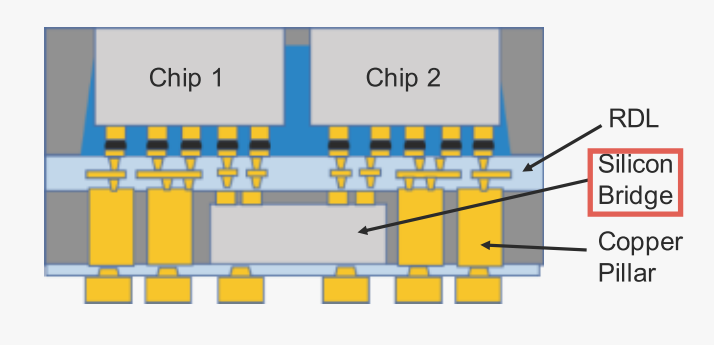

在MCM和小芯片设计中，**跨封装基板的裸片（die）到裸片（die）通信链路通常限于大约几十GB/s**。主要约束是在典型的**有机基板**实现中可以支持的**金属布线的宽度/密度（板上布线，单层？）**。

**Interposer**实际上是一个“芯片”，**其目的是提供多个其他芯片之间的互连**。

**Interposer**使用传统的后端工艺来构建其金属布线层，因此**可以提供与任何其他芯片相似的互连密度**：可以在相对较小的区域内提供数千条并行路由，从而支持高性能内存接口所需的数百GB/s带宽。

硅内插器仍然利用硅通孔（TSV）来提供从各个芯片到封装外部的IO、电源和接地连接。

## 2.5 Silicon Bridges

取决于给定SoC设计的特定要求，硅中介层可能具有限制或权衡，使得其他方法更可取。

**Interposer的尺寸**必须足够大，以容纳所有堆叠在其上的2.5D芯片：

​	虽然典型的用例（例如存储器集成）利用**无源插入器**（即没有逻辑器件/晶体管）有很好的良率，但是非常大的内插器仍然增加了系统的成本。

​	如果芯片的总数量的总体尺寸**超过掩模版限制**（通常在800- 900 mm 2之间）的中介层尺寸，则必须产生额外的成本来支持掩模版拼接技术（多光罩拼接）以构造更大的中介层[4]。

硅桥技术已被开发为替代封装解决方案，以提供硅级的导线密度，同时使用小得多的硅片。

硅桥是一个小的无源芯片，它提供了与上面芯片的电接口，与硅中介层非常相似。但它**只需要大到足以覆盖桥接器连接在一起的两个芯片的裸片（die）到裸片（die）连接接口。**

**在桥接器占据的区域之外，可以使用传统的铜柱技术直接向芯片提供IO、电源和接地信号。**

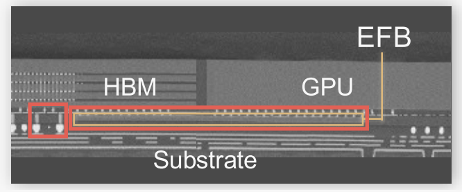

## 3D Stacking: Microbumps

到目前为止讨论的技术都用于将多个小芯片连接在一起，其中所有有源组件（即不计算无源内插器或桥）彼此**相邻放置**

3D堆叠可以通过将一个或多个有源芯片直接放置在彼此的顶部上来进一步增加集成密度和裸片（die）到裸片（die）带宽。

微凸块（Microbumps）实际上是非常小的焊料连接（取决于具体实现具有不同的冶金）。

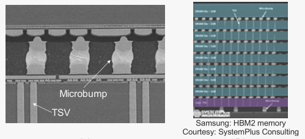

两个芯片垂直连接微凸点的横截面显微照片

微凸块接合面临一些挑战，包括由于微凸块和相关联的金属**连接焊盘的附加高度**以及**微凸块的热电阻**更高。

**互连密度还受到微凸块的尺寸的限制**，微凸块的尺寸可能难以缩放到非常小的尺寸和间距。

## 3D Stacking: Hybrid Bonding

最近的3D堆叠技术使用两相混合结合工艺：两个芯片直接融合在一起，而不是用微凸块将两个芯片上的金属焊盘连接在一起。

第一阶段：在两个芯片各自表面的氧化物之间形成共价键

第二阶段：更高温度的铜-铜键合工艺，使每个芯片上的金属焊盘直接熔合在一起。

通过**完全消除微凸块**，混合键合可以**支持更高的互连密度**（微凸点为**10微米**，混合键合为**个位数微米**）

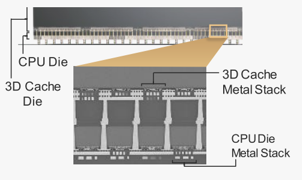

Hybrid Bonding

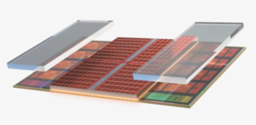

AMD V-Cache™技术：额外的无源填充硅（在图中示出为浮动灰色块）堆叠在CPU计算逻辑的顶部，以帮助将热量从处理器管线传导到封装的冷却解决方案（未示出）。与基于微凸块的3D堆叠相比，没有微凸块或微凸块的直接裸片（die）到裸片（die）界面提供了热上优越的上级路径。

## FUTURE SILICON CITYSCAPES（硅城市景观）

然而，随着系统要求的不断提高，技<u>术扩展速度的放缓</u>，以及<u>封装尺寸的停止增长</u>，我们相信，将更多功能集成到单个封装中的愿望将不可避免地推动在同一设计中<u>同时使用多种2D，2.5D和3D方法</u>。

### 互连基础设施

* 不同的小芯片和芯片堆栈可能会有不同的需求，具体取决于带宽、延迟、功耗、服务质量、优先级等。在探索如何以一种可扩展、高性能和高能效的方式有效地互连所有东西，同时在小芯片之间提供轻松的互操作性和模块化方面，存在着重大的研究机会。该领域包括一系列“**片上网络”（NoC）**主题，但扩展到了小芯片的边界，概括到了第三维，并且由于2D/2.5D/3D技术的混合，必须**协商一组异构的接口**。

* Silicon Cityscape互连的另一个研究主题是**设计协议**，以支持许多不同小芯片的简单互操作性和可组合性/模块化。

### 电源输送与散热

与城市电源传输类似，在密集集成的硅城市景观中，出现了类似的挑战，

* 需要研究可以**跨越不同2D/2.5D/3D和硅衬底边界的有效配电架构**。

* 穿过许多顺序TSV到达顶层**的累积IR效应**，向堆叠的顶层的电源输送可能变得越来越困难。

* 复杂的封装和堆叠拓扑结构还可能导致各种各样的电感路径，从而导致$Ldi/dt$挑战。

* 可能需要对软件层的协同设计进行研究，或者至少非常有益，以避免将过多的工作集中在硅城市景观的一个位置，这将使本地配电能力负担过重

* 与配电携手并进是散热的挑战：基于**微凸点的3D堆叠**可能具有挑战性，因为夹层夹层具有更高的热阻，这阻碍了热量从下层流向冷却界面通常所在的顶部。**混合式3D焊接技术**有所帮助，但由于功率密度增加，仍然存在根本性的挑战。任何一种形式的3D堆叠都可以进一步聚集热热点，因为裸片（die）减薄会降低小芯片的横向/平面热导率，导致热量被困在更小的区域中，从而导致更高的温度。再次研究与软件的协同设计可能是一种有效的方法，可以通过整个软件包中不同计算资源的智能调度和工作布局来降低热挑战的程度。

* 确定堆叠的层之间的最佳堆叠组织和/或工作放置（**tradeoff**）：计算最密集和功耗最高的工作将有利于放置在堆叠的底部小芯片上，以最大限度地**提高电力输送的质量和可靠性**。然而，在堆叠的底部的放置可能是在**散热方面最差**的地方，因此优化功率输送或热气流对于另一个来说往往是次优的。需要进行大量的研究，以有效地在硅城市景观中同时管理两者。

### 可靠性

-

# ★ Architecture, Chip, and Package Codesign Flow for Interposer-Based 2.5-D Chiplet Integration Enabling
Heterogeneous IP Reuse

Jinwoo Kim , Graduate Student Member, IEEE, Gauthaman Murali , Heechun Park,

Eric Qin, Graduate Student Member, IEEE, Hyoukjun Kwon , Graduate Student Member, IEEE,

Venkata Chaitanya Krishna Chekuri , Graduate Student Member, IEEE,

Nael Mizanur Rahman, Graduate Student Member, IEEE, Nihar Dasari, Arvind Singh, Member, IEEE,

Minah Lee , Graduate Student Member, IEEE, Hakki Mert Torun , Graduate Student Member, IEEE,

Kallol Roy, Member, IEEE, Madhavan Swaminathan, Fellow, IEEE, Saibal Mukhopadhyay, Fellow, IEEE,

Tushar Krishna, Member, IEEE, and Sung Kyu Lim, Senior Member, IEEE

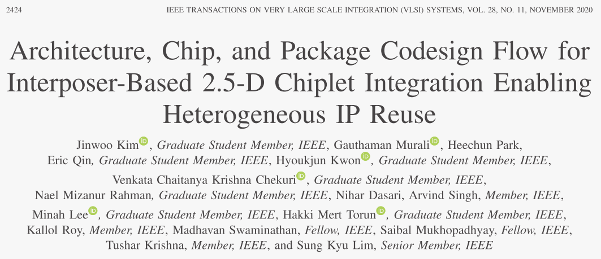

​	在本文中，我们提出了一个高度集成的设计流程，包括架构，电路和封装，以构建和模拟异构的2.5-D设计。我们的目标设计是基于精简指令集计算机（RISC）-V处理器的64核架构。我们首先通过**添加逻辑协议转换器和物理接口模块(logical protocol translators and physical interface modules.)**来对每个IP进行**chipletize**。我们将一个给定的寄存器传输级（RTL）的64核处理器转化为小芯片，并通过我们的集中式片上网络增强。接下来，我们使用我们的工具来获得物理布局，随后用于合成芯片到芯片I/O驱动器，这些小芯片被放置/路由在硅中介层上。**我们的<u>封装模型</u>用于计算2.5维设计的功耗、性能和面积（PPA）以及可靠性**。我们的**设计空间探索（DSE）**的研究表明，2.5-D集成相比2-D招致1.29倍的功率和2.19倍的面积开销。此外，我们进行DSE研究的电源传输方案和中介层技术，**调查在2.5-D集成芯片（IC）设计的权衡**。

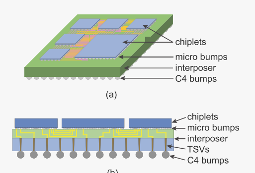

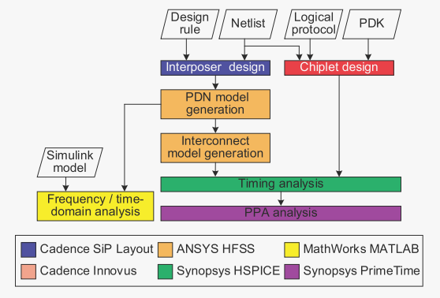

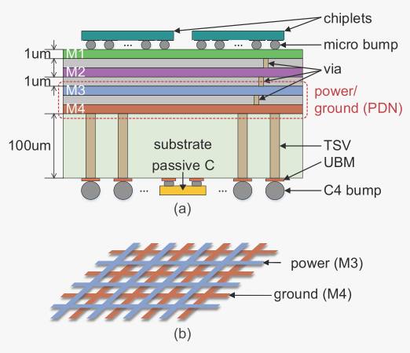

## Interposer Timing and Power Analysis

我们考虑采用全摆幅信号的AIB作为I/O驱动器。需要一个强大的输出驱动器来驱动长插入器导线。此外，内插器导线具有显著的电感，由于它们的大尺寸而导致来自驱动器和接收器端两者的信号反射。为了消除这些反射，最终驱动器级的阻抗与封装线的特性相匹配。为了减少I/O的开销，I/O驱动器在电源电压的全摆幅下运行。对于商用28 nm技术节点，最终驱动器尺寸选择为×80，输出阻抗为47.4。对于时序分析，我们测量了数据总线中所有导线之间的芯片到芯片通信延迟和偏斜，以及端到端的时钟。**我们通过生成中介层互连通道的传输线模型来执行我们的设计的时序分析**。在我们的设计中，互连长度从200到9370 μm不等。**对于传输线模型，我们使用[22]中基于机器学习（ML）的算法生成了参数化HSPICE模型。为了表征传输线的电气特性，需要进行从直流到千兆赫的大频率范围的全波电磁仿真，这需要很长的CPU时间。因此，我们<u>使用高效贝叶斯框架（EBF）[23]生成插入器传输线的代理模型</u>，该模型取代EM求解器来解决这个问题。**

​	为了使用**高斯过程（GP）**创建代理模型，我们首先基于**均匀拉丁超立方体采样（LHS）**确定样本，并在**单个频率点提取RLGC矩阵**，而不是扫描整个范围。由于每个样本都在单个频率点进行表征，因此收集训练数据的总CPU时间显着减少。然后将收集的**样本标准化**为具有<u>零均值和单位标准差</u>，并用于**执行GP模型的训练以预测插入层中的传输线的RLGC矩阵**。最后，我们**将相应的RLGC模型纳入我们的HSPICE电路的设计中的所有互连通道的传播延迟分析**。

​	**SI**：通过**将传输线模型的RLGC矩阵转换为相应的S参数**并将其输入Keysight ADS，进行SI分析并**生成眼图**。我们的布线涉及到使用复杂的互连结构，如图17（a）所示，因为与简单结构相比，它们有助于降低串扰。因此，我们将重点放在复杂的互连通道上进行串扰分析。眼图的特性如下：眼宽为0.995 ns，眼高为0.860 V。这些结果是基于在1 Gb/s的数据速率、考虑理想情况的50的I/O驱动器阻抗和2 pF电容的接收器小芯片焊盘寄生下进行的模拟而获得的。

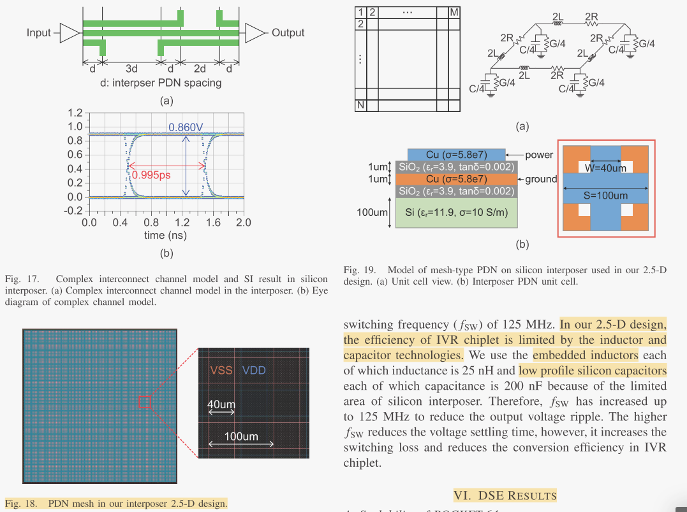

## Silicon Versus Organic Interposers

硅内插器在RDL间距小于1 μm时提供了最佳的互连密度，但与其他内插器技术相比，它具有较高的制造成本和较差的沟道特性。有机内插层由于其低价格和高速通道特性而被引入作为硅内插层的有前途的替代技术。然而，有机内插层具有这样的局限性，即，尽管努力改进有机内插层技术，但其设计规则仍然大于硅内插层。

# ★ Chipletizer: Repartitioning SoCs for Cost-Effective Chiplet Integration

Fuping Li∗‡§, Ying Wang†‡§¶, Yujie Wang†‡¶, Mengdi Wang†‡, Yinhe Han†‡¶, Huawei Li∗‡, Xiaowei Li∗‡§

∗SKLP, Institute of Computing Technology, Chinese Academy of Sciences

†CICS, Institute of Computing Technology, Chinese Academy of Sciences

‡University of Chinese Academy of Sciences

§Zhongguancun National Laboratory, ¶Zhejiang Laboratory, 	Peng Cheng Laboratory

{lifuping20s, wangyujie, wangying2009, wangmengdi, yinhes, lihuawei, lxw}@ict.ac.cn

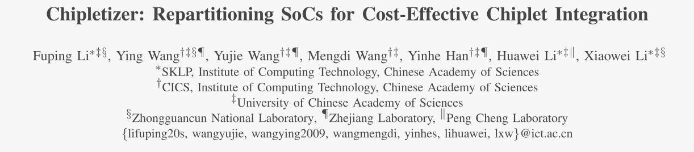

​	在本文中，我们提出了Chipleizer，这是一种**指导设计划分的框架**，适用于那些将受益于SoC产品线上的小芯片重用的人。该通用框架支持将多个SoC重新划分为可重用的小芯片，并可**根据用户指定的参数经济、高效地进行划分**。仿真结果表明，提出的划分策略较已有的划分策略在功耗和延迟开销可接受的情况下，在实际产品上实现了显著的成本改善。

​	我们制定的SoC**重新分区**问题，通过使用SoC设计和chiplets的一般表示，其中**提取的重要信息**用于chipletization，包括**硬件组件和通信需求**。

​	我们提出了**Chipletizer**，一种**自适应框架**，用于有效地**将多个单片SoC划分为最佳小芯片**。该框架可以被设计人员实践以**降低SoC产品线的成本**，这有望缓解当前半导体行业所面临的成本挑战。

​	与现有的分区策略相比，所提出的框架在低容量和高容量设计上实现了至少22.89%和7.63%的**平均成本降低**。特别是，它还**创造了超越现有分区经验的前所未有的形式的小芯片（？？我随便乱分也能实现这样的效果吧）**。

## Design Partitioning Challenges

​	**均匀划分方法[3，6]**将简单的多核系统划分为相同的小芯片：对于由不同类型和数量的IP组成的现实SoC是不实际的。

​	**平衡划分方案[15]**旨在增加die产量，同时最小化小芯片间traffic：但是导致**较差的系统内小芯片可重用性**和**较高的NRE成本**。

​	**(?) 基于IP的策略[8]**严格地限制了每个IP，由于低封装产量和不充分的小芯片重用，它不能扩展到包括大量IP的SoC，这可能导致比单片系统更高的成本。此外，无法将紧密交互的IP聚集到同一个小芯片中，导致显著的功率和性能损失。

​	**这些现有提议中没有一个同时划分<u>多个系统以探索系统间的硅重用（如果一次只流一个片，谁跟你重用？）</u>，使得它们错过了进一步分摊NRE成本的机会。**

## CHIPLETIZER METHODOLOGY

### Problem Formulation

设计被假设为由不同类型和数量的块（**block**）组成，即用户定义的**最小划分粒度**。

​	设计表征图是有向图（directed graph）：$ DCG(B,E) $

​	分割的结果：$ B = \{B'_1,B'_2, ...\}, \bigcup B_i=B, B_i \bigcap B_j=0	(i \neq j) $

​	跨chiplet traffic：$ χ_{i,j} = 1 (b_i ∈ B_p, B_j ∈ B_q, p \neq q \quad else \quad 0) $

在本文中，我们考虑了三个重要的指标，即功耗（P）、延迟（L）和成本（Co）。

$ w_i $：设计$ D_i $的权重；

系数$ α_i $、$ β_i $和$ γ_i $用于实现用户指定的功率和延迟开销与成本降低之间的权衡；

归一化系数$ P'_i $、$ L'_i $和$ Co'_i $：通过多次扰动初始分区，并在优化开始之前获得平均评估结果。

采用图3所示的两级分层划分方法：

​	type level：被划分成具有不相交块类型的组$ Si = \{G_1^i, G_2^i，...\} $的集合

算了看不懂，变量都没写全

### Chipletization Overhead Estimation

-

## Two-Phase Optimization Flow

看起来应该是Flow+Algorithm+Experiment

# ★ （2020-ICCAD）Coupling Extraction and Optimization for Heterogeneous 2.5D Chiplet-Package Co-Design

| MD Arafat Kabir University of Arkansas makabir@uark.edu | Dusan Petranovic Mentor Graphics dusan_petranovic@mentor.com | Yarui Peng University of Arkansas yrpeng@uark.edu |
| ------------------------------------------------------------ | ------------------------------------------------------------ | --------------------------------------------------------- |

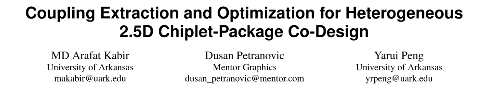

​	在本文中，我们提出了我们**的整体和上下文芯片封装协同设计流程**，用于高性能高密度2.5D系统，使用标准的ASIC CAD工具。我们的流程包括2.5D partitioning，芯片封装共同规划( co-planning )，上下文提取( in-context extraction )，迭代优化( iterative optimization)，以及整个2.5D系统的设计后分析和验证( post-design analysis and verification )。我们设计我们的包规划器与路由和引脚规划策略，以尽量减少包路由拥塞和时间开销。

​	目标是以**整体**的方式规划小芯片引脚配置和封装布局，以最**小化封装布线相关的问题**

## 芯片封装协同规划和建模

​	开发了一个**RDL规划工具**来实现我们的芯片**封装布局规划策略**。

​	用于小芯片实现的第一代的chiplet引脚处的封装**线负载的粗略估计**。

## 芯片-封装协同设计与优化

​	将整个系统、小芯片和软件包一起加载到设计环境中

​	使用**RDL规划工具**生成的脚本执行每个module（chiplet）的布局（placement）和引脚分配（pin assignment）以及封装布线（package routing）：模块被分离为分层子设计，并且封装设计被保存为顶层设计

### Chiplet Implementation

​	每个小芯片被视为单个2D芯片，并使用传统的芯片设计技术进行设计。

​	我们修改小芯片设计约束文件，以包括由我们的RDL规划工具估计的小芯片引脚处的线负载。

​	We already have the pin placement and the initial floorplan prepared at the top level. However, this floorplan can be adjusted if necessary as long as pin configurations are unchanged.

​	在最终确定平面布置图之后，配电网络被设计为确保向小芯片的所有部分的均匀电力输送。然后，我们使用标准的工具来执行标准的单元布局，电源布线，时钟网络设计，布线和时序优化。最后，添加填充单元和金属填充物以完成小芯片设计。

### Package Implementation

## Iterative Optimizations

​	负载只是粗略的估计，我们几乎总是期望有一些改进的空间。在设计组装的第一次迭代之后，提取工具可以提供准确的寄生信息，并且分析工具可以生成更严格的时序预算。

​	在接下来的迭代中，我们使用在前一次迭代的设计组装之后提取的时序上下文，而不是使用估计的线负载和时序预算。

​	随着小芯片的新实现，我们可以执行另一轮的设计-组装和分析。该过程可以多次迭代，每次都具有更精确的寄生效应和时序预算，直到不再可能提高系统性能或满足目标性能。

​	然而，通过我们的RDL计划器生成的良好估计，只需第二次迭代就足以验证和关闭差异。

# ★ （18-ICCAD）A Cross-Layer Methodology for Design and Optimization of Networks in 2.5D Systems

Ayse Coskun1, Furkan Eris1, Ajay Joshi1, Andrew B. Kahng2,3, Yenai Ma1, and Vaishnav Srinivas2

1ECE Department, Boston University, Boston, MA, USA; 2ECE and 3CSE Departments, UC San Diego, La Jolla, CA, USA

acoskun@bu.edu,fe@bu.edu,joshi@bu.edu,yenai@bu.edu,abk@eng.ucsd.edu,vaishnav@ucsd.edu

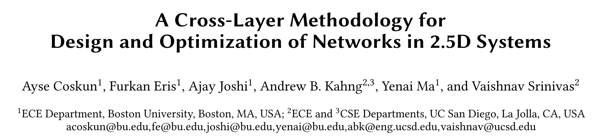

​	本文介绍了一种跨层的方法来设计网络在2.5D系统。我们**跨逻辑、物理和电路层联合优化网络设计和小芯片布局**，以实现**高能效网络**，同时最大限度地提高**系统性能**，最大限度地**降低制造成本**，并**遵守热约束**。

​	在逻辑层，我们的**协同优化考虑了八种不同的网络拓扑**。

​	在物理层中，我们**考虑布线、微凸块分配和微凸块间距约束**，以考虑与**小芯片间通信中的微凸块利用相关联的额外成本**。

​	在电路层，我们考虑具有**五种不同链路类型的无源和有源链路，包括加油站链路设计（gas station link design）**。

## INTER-CHIPLET NETWORK DESIGN

Each core, together with its L1 and L2 caches, has a square layout.

the **22nm chiplets** are placed on an **interposer** that is designed in **65nm** process technology.

**Microbumps** connect the chiplets to the interposer substrate.

The system is placed on a System-in-Package (SiP) substrate, with **C4 (“flip chip bumps”)** connecting the interposer to the SiP substrate.

### Logical Layer

探索了几种不同的网络拓扑[35]。

**小芯片内网络**：限制为**Local-Mesh**和**Local-Cmesh**拓扑；

**小芯片间网络**：设计并评估了**Global-Butterfly**、**Global-Butterdonut** [16]和**GlobalMesh**拓扑；

**统一网络**：我们评估**UnifiedMesh**和**Unified-Cmesh**。

### Physical Layer ?

小芯片间网络的物理设计：小芯片的**放置**，连接小芯片的**路由**解决方案。

​	小芯片的放置影响温度图和小芯片之间的链路的长度，而布线解决方案又影响链路的微凸块分配和电路选择。

​	考虑微凸块的面积开销以及沿着小芯片的沿着区域放置的相关联的小芯片间驱动器和接收器。

​	采用passive interpooser而不是active interposer

​	采用**gas station link**（我的理解：通过repeaters and/or flip-flops实现长距离互连的中继，如下图所示）

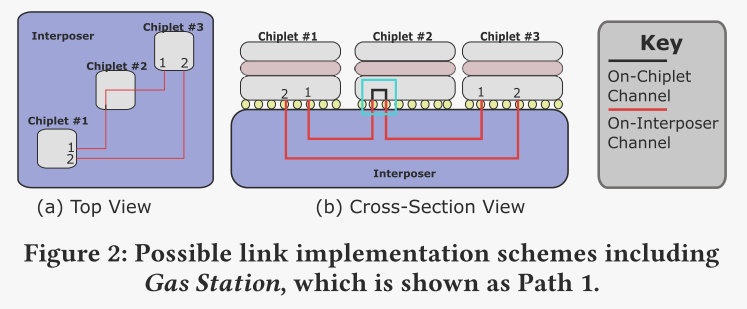

### Circuit Layer

由于包含了**gas station**，链路可以在中间小芯片中使用中继器和/或触发器（用于流水线）来重新生成和重新定时信号

## CROSS-LAYER CO-OPTIMIZATION

首先分别构建**系统性能，成本和互连性能的预测（Oracle）**。

使用**模拟退火**找到一个位置，满足**热约束和最大链路长度约束**的HotSpot和路由MILP（与互连性能Oracle提供的最大值）分别评估。

### Cross-Layer Co-Optimization Flow

# ★ （2015-ASPDAC）IR to Routing Challenge and Solution for Interposer-based Design

所提出的方法是文献中第一个可以处理芯片中介层布线和静态 IR 压降的微凸块规划的工作。

 该方法根据芯片中的凸块规则和功率信息，分析微凸块的位置以满足 IR 约束。 

对于芯片中介层布线，计算几何技术（例如 Delaunay 三角测量和 Voronoi 图）应用于网络流公式，最大限度地减少 IR 压降和总线长。 

该方法适用于布局规划阶段。

## PROBLEM FORMULATION

芯片中介层协同设计问题是规划微凸块并连接：

​	I/O 焊盘组 P、

​	微凸块组 B 和 

​	TSV 组 H，

使得：

​	每个 RDL 中没有导线交叉，

​	凸块分配满足 IR 约束，

​	并且总的 线长最小化。

## THE CHIP-INTERPOSER CO-DESIGN ALGORITHM

### Algorithm Overview

​	算法由两个阶段组成：(1) 基于每个倒装芯片功耗的**bump规划**，以及 (2) 基于 DT、VD 和 ILP 的**芯片-中介层布线**。

### Micro-Bump Planning

* Power-Bump Density Analysis and Bump Placement
* IR-aware Conductance Calculation

### Chip-Interposer Routing

* RDL Routing
* IR Constraint Modelling
* Interposer Routing

