# 研究记录

---

## ★ 2024.08.07汇报
### 一、重分布层（Redistribution Layer，RDL）相关论文
* 思路基本是global+detail，global做的是assignment（分为free assignment，pre-assignment，unified-assignment）和路由指导（MCMF, ILP, A*搜索等）；detail做的就是具体布线，约束，目标等
* 创新点早期有单层到多层，固定角度（45，135）到任意角度，不同array下的布线（square grid array，staggered array，A hexagonal array）

### 二、Deep Trench Capacitor（DTC，Integrated Capacitor，iCap）相关论文
* iCap大概是做什么的：解决signal and power integrity problem

* DTC-first和TSV-first相关论文：Integrated Deep Trench Capacitor in Si Interposer for CoWoS Heterogeneous Integration

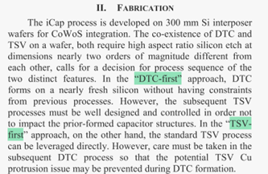

### TODO List

* iCap与TSV的论文

---

## ★ 2024.08.14汇报

### 一、学习PRML

* 第一章
  * 1.5 决策论

  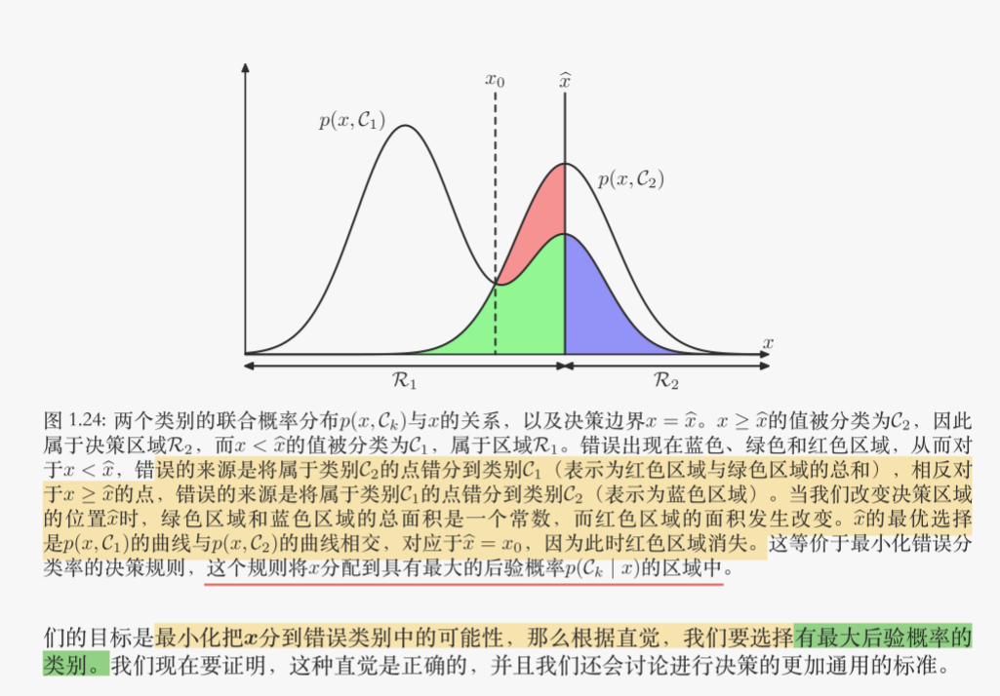

  * 1.6 信息论

  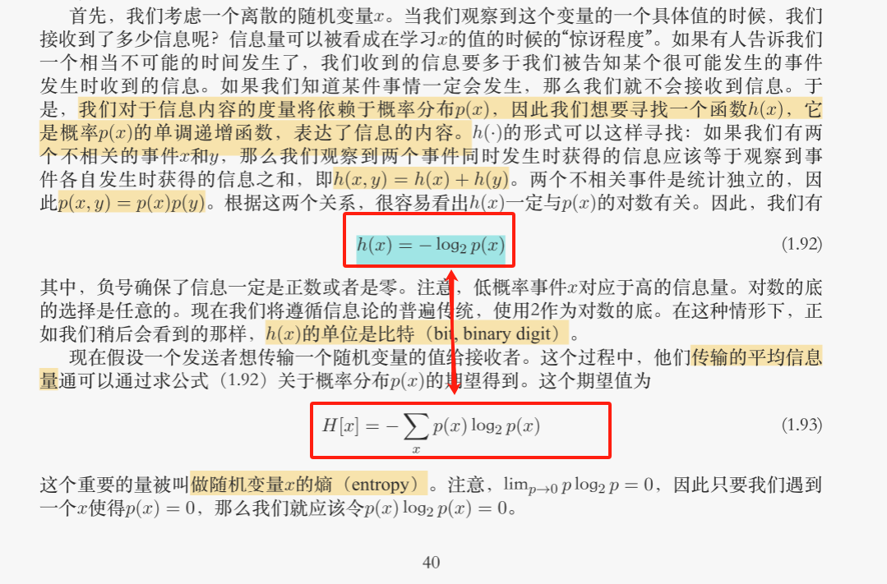

  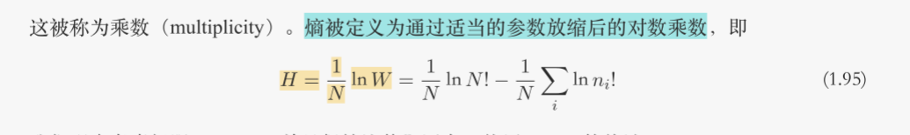

  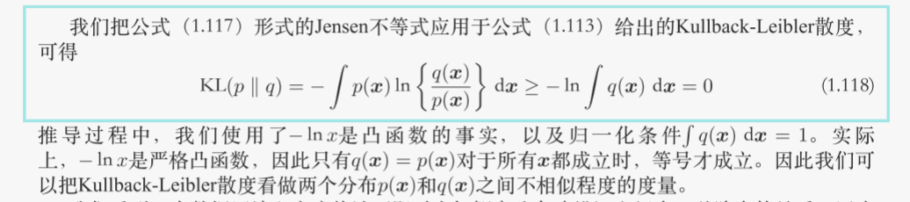

  * 

* 第二章

  * 2.1 Beta分布

  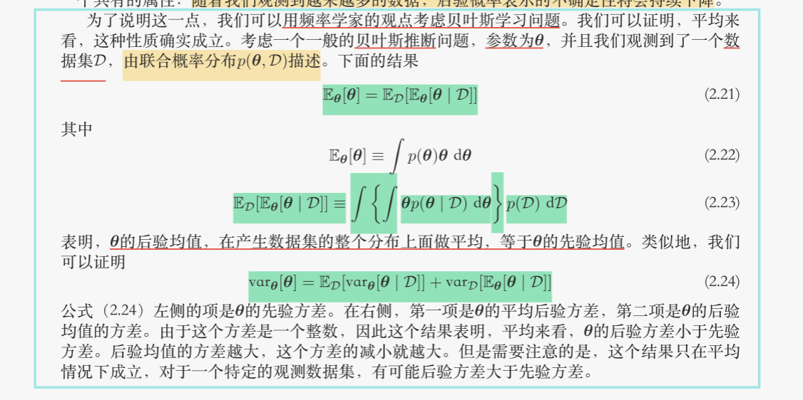

  * 高斯分布，Gamma分布，学生t分布等
  * 周期变量
  * 混合高斯模型

### 二、讲座：2.5D/3D集成芯片的工艺原理与架构分解

Macro Bump, C4 Bump, hybrid bounding, active interposer, I/O die

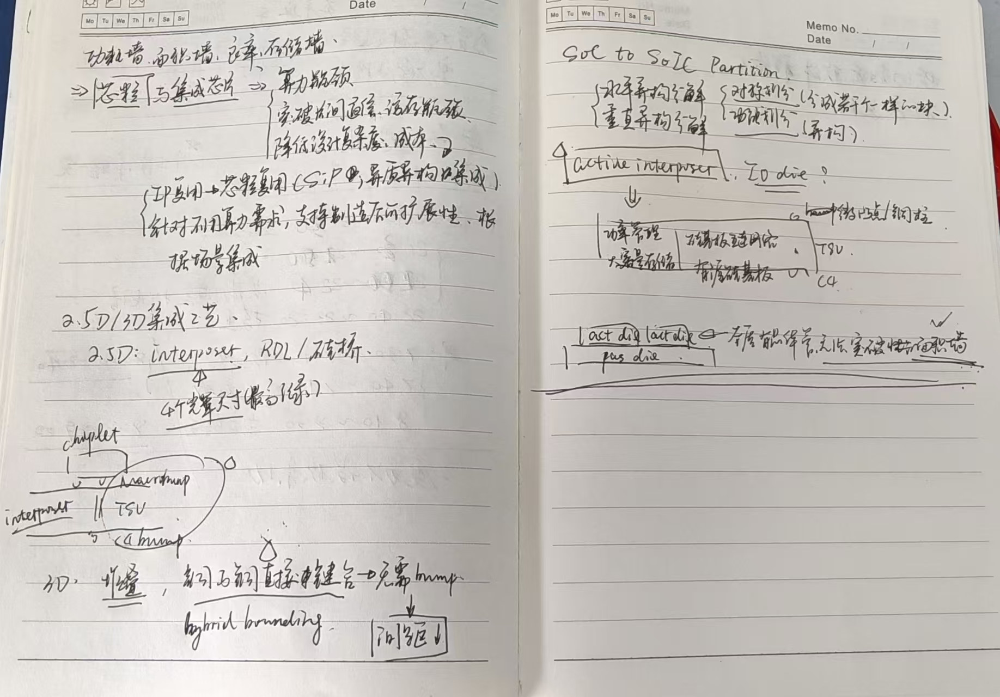

### 三、论文

* **Multiobjective Optimization for PSIJ Mitigation and Impedance Improvement Based on PCPS/DR-NSDE in Chiplet-Based 2.5-D Systems**

  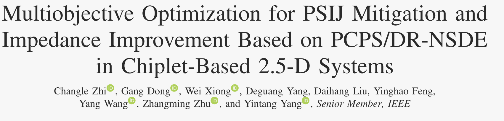

  * **Abstract**
    * chiplet also introduces significant noise challenges
    * This article present an algorithm, incorporating power supply induced jitter (PSIJ), system impedance, target impedance, anddecoupling capacitors
      * collaborative optimization and analysis of jitter, noise, and impedance in 2.5-D systems
    * An automatic channel model algorithm and a uniform  decoupling capacitor placement strategy  are proposed
    * others
      * Pareto front, some strategy is proposed to improve algorithm performance, 
  * **INTRODUCTION**
    * device density and the shared power systems in 2.5-D IC $\Rightarrow$ considerable power integrity problems ( particularly the jitter issue )
      * imperfect parasitic impedance of the <u>power delivery network (PDN)</u> and the fluctuating current within the circuitry
      * $\Rightarrow$ voltage fluctuations
      * $\Rightarrow$ power supply induced jitter (PSIJ) issue 
    * <u>simultaneous switch noise (SSN)</u> is a significant contributor to jitter
      * The employment of <u>decoupling capacitors</u> can lower-system impedance and mitigate the issues arising from the noise.
    * existing research is currently focused on strategies for the placement of decoupling capacitors
      * predominantly focus on PSIJ modeling or decoupling methods, with a noticeable absence of comprehensive analysis of other associated components in chiplet-based systems.
    * present a multiobjective optimization encompassing PSIJ, impedance, target impedance, and decoupling capacitor in 2.5-D IC
  
* **(2017-TCAD) Decoupling Capacitors Placement for a Multichip PDN by a Nature-Inspired Algorithm**

  * PDN及unit cell（UC）模型：参考

    * [9] (LMWC-2017)Analytical Unit Cell Assembly for Efficient Chip Package Power Distribution Network Modeling
    * [9] [12] (2012-TPMT)Modeling and Analysis of a Power Distribution Network in TSV-Based 3-D Memory IC Including P/G TSVs, On-Chip Decoupling Capacitors, and Silicon Substrate Effects

    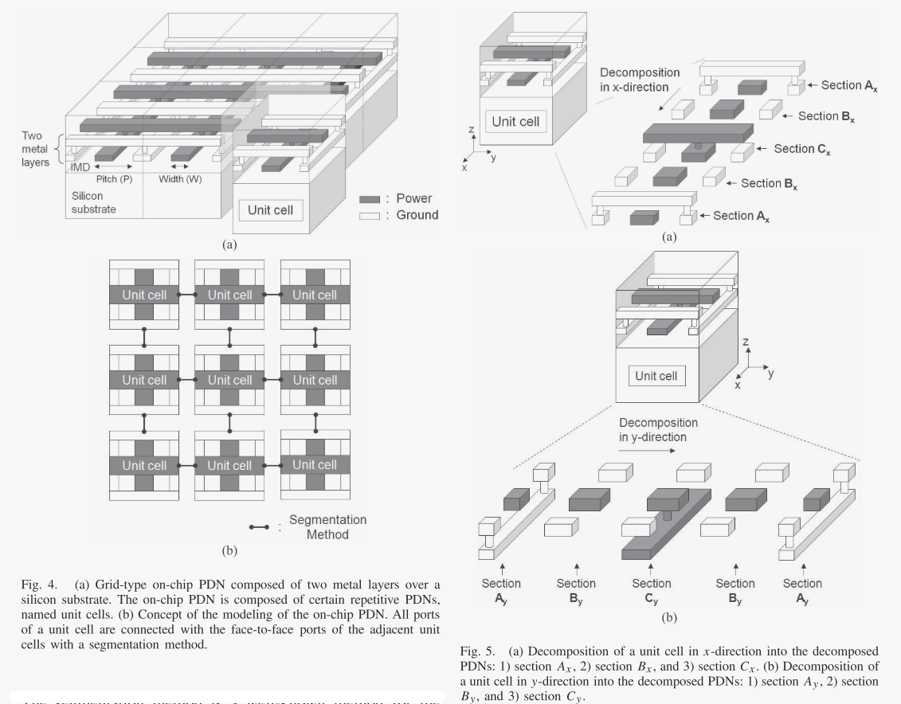

  * An automatic assembly process of the equivalent circuits of PDNs, decaps, bump and TSVs is developed based on the S-parameter data concatenation technique introduced in [13].

  * The validated PDN automatic assembly tool [19] will be used in the following for the optimization of the value and locations of the decaps on the PDN.

  * **Nature-Inspired Algorithm**

    * the “fixed” strategy：the position of the decaps are fixed by the designer but their values are to be foundby the GA

    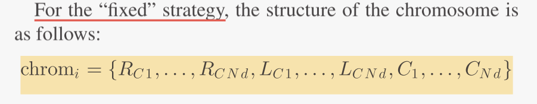

    * the “moving”strategy：both the positions and the values of the decaps are variables to be found by the GA

    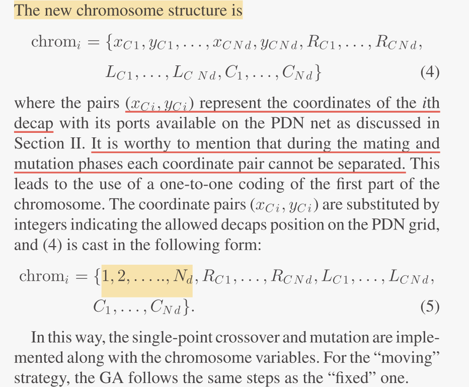

  * 

### 四、问题

#### 1. 封装基板

* build-up layer什么结构，什么功能，和RDL在功能上的区别是什么

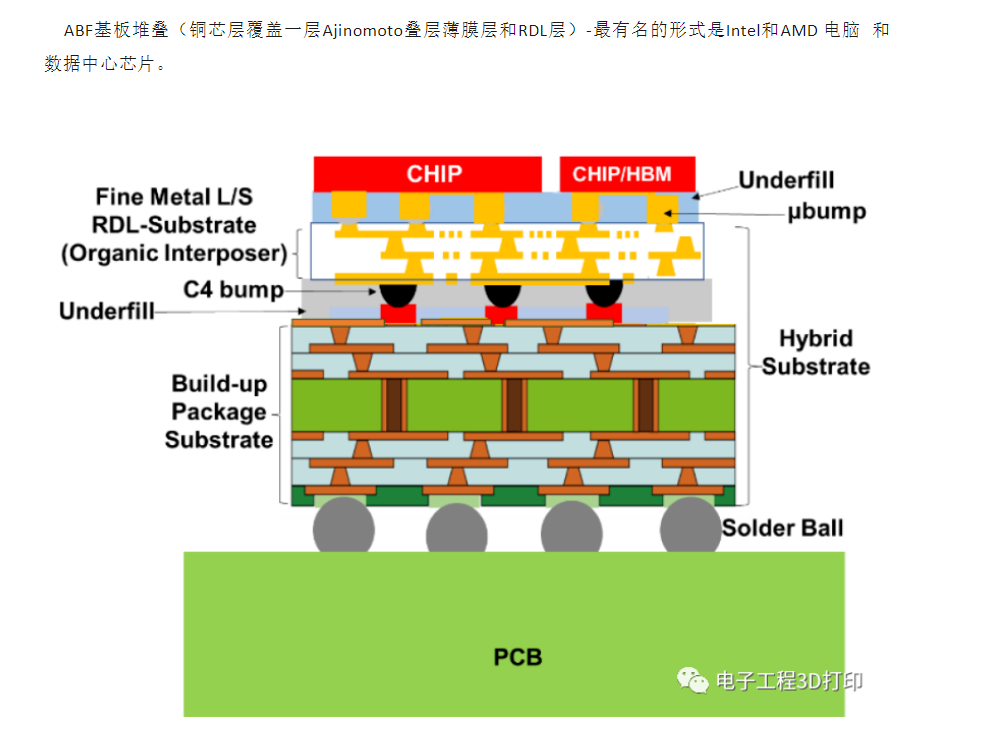

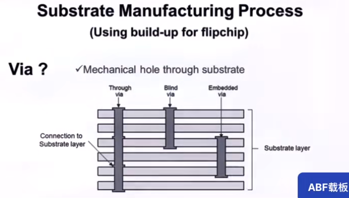

* 有芯基板和无芯基板（参考资料：[先进封装基板](file:///C:/Users/HJH/Desktop/研究方向/物理设计优化/record/link/先进封装基板.mhtml)）
* 有芯基板的刚性芯板层相比于其他层更厚，其通孔直径与其他层之间的差别，导致高频信号在传输过程中存在反射和延迟问题。无芯封装基板厚度仅为传统基板厚度的1/3，厚度降低，不仅使无芯基板更能适应消费类电子产品轻、薄、短、小的趋势，还使它具有更高的信号传输速度、更好的信号完整性、更低的阻抗、更自由的布线设计、以及能够实现更精细的图形和间距等特点。
* 与此同时，缺乏钢性芯板的机械支撑，使得无芯封装基板强度不足，易于翘曲。如何减少制造和装配过程中的翘曲，成为无芯封装基板研究和生产领域的重要课题。三星电子的Kim[8]、矽品的David等通过仿真和实际试验等方式分析无芯封装基板翘曲的热、机械等因素，指导无芯封装基板的设计和生产。常见的降低无芯封装基板翘曲的方法有：在半固化片中添加玻璃纤维以增加刚度，将基板表层电介质材料更换为刚度更强的半固化片，使用低热膨胀系数电介质材料以降低Cu线路-电介质材料之间热膨胀系数失配导致的翘曲，针对制程开发能够减少翘曲的合适夹具，平衡基板各层覆铜率以减少上下层热膨胀系数失配等。
* 埋入式封装基板（参考资料：[先进封装基板](file:///C:/Users/HJH/Desktop/研究方向/物理设计优化/record/link/先进封装基板.mhtml)）
* 参考：
  * [一文看懂封装基板-电子工程专辑](file:///C:/Users/HJH/Desktop/研究方向/物理设计优化/record/link/一文看懂封装基板-电子工程专辑.mhtml)
  * [先进封装，越来越模糊](file:///C:/Users/HJH/Desktop/研究方向/物理设计优化/record/link/先进封装，越来越模糊.mhtml)
    * [异构集成封装类型：2D、2.1D、2.3D、2.5D和3D封装详解](file:///C:/Users/HJH/Desktop/研究方向/物理设计优化/record/link/异构集成封装类型：2D、2.1D、2.3D、2.5D和3D封装详解.mhtml)
    * [先进封装基板](file:///C:/Users/HJH/Desktop/研究方向/物理设计优化/record/link/先进封装基板.mhtml)
    * [半导体封装的载体-封装基板](file:///C:/Users/HJH/Desktop/研究方向/物理设计优化/record/link/半导体封装的载体-封装基板.mhtml)
    * [倒装芯片基板技术介绍](file:///C:/Users/HJH/Desktop/研究方向/物理设计优化/record/link/倒装芯片基板技术介绍.mhtml)

#### 2. 电源分配网络（PDN）

`电源完整性（Power Integrity, PI），去耦电容，目标阻抗`

* [深刻理解电源完整性PI，图文并茂，浅显易懂-CSDN博客](file:///C:/Users/HJH/Desktop/研究方向/物理设计优化/record/link/深刻理解电源完整性PI，图文并茂，浅显易懂.mhtml)

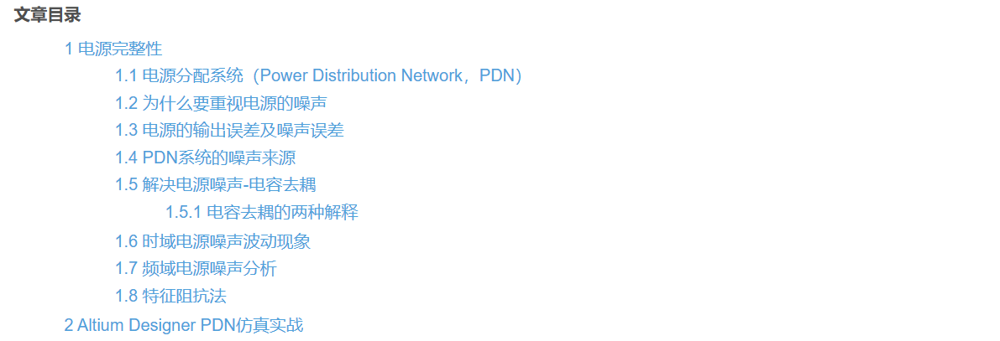

* [信号完整性专题【1】——电源完整性（PI）_pdn目标阻抗计算-CSDN博客](file:///C:/Users/HJH/Desktop/研究方向/物理设计优化/record/link/电源完整性（PI）.mhtml)

### TODO List

* 继续看下PDN，然后把上周没看完的论文看完
* 软件安装，研究下软件使用

---

## ★ 2024.08.21汇报

### 论文

* **PEEC-Based On-chip PDN Impedance Modeling Using Layered Green’s Function**<u>（问严老师）</u>余文剑-》徐宁，严老师
  * Introduction
    * The necessity of the calculation of PDN impedance（high impedance level across a high bandwidth might generate a large
      amount of SSNs）
    * $\Rightarrow$ it is really useful to accurately model the impedance of on-chip PDN for estimation of SSNs
    * **But**: Because **the dimension range of on-chip PDN is wide** and the **geometry and material are complex**, it is **difficult** to obtain <u>the impedance of on-chip PDN with separated power and ground current paths</u> by full-wave simulation as mentioned in [6].
    * Methodology
      * **Firstly** the unit cell of PDN is extracted based on a segmentation method. 
      * **Then** the equivalent circuit of unit cell is modeled by PEEC method. The equivalent circuit of whole PDN is presented by connecting the equivalents circuits of all unit cells. 
      * **Because** the **lossy silicon substrate** right below on-chip PDN could affect the capacitive couplings between metal lines of on-chip PDN, the LGF was introduced to achieve the right capacitance between metal lines.

* **Chip-Package Hierarchical Power Distribution Network Modeling and Analysis Based on a Segmentation Method**<u>（用这个technique需要什么）</u>

  * **“divide and conquer” strategy**: The key ideas of the proposed modeling method are to **decompose** the chip-package hierarchical PDN into several structures, **independently calculate** the decomposed structures, and extract the whole structure’s impedance by using a **segmentation method**.

    * A new modeling method is proposed for a **chip level PDN**
    * resonant cavity model and parameter of AWFF (added width for fringing field) are used for a **package level PDN**
    * and equivalent circuit models are used for **interconnections**.

  * **Segmentation Method**

    

    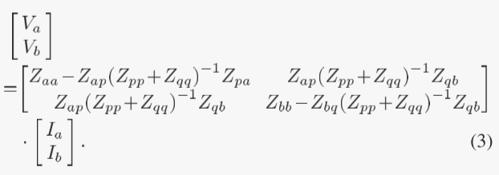

    Consequently, the impedance matrix of the total structure can be derived by using the impedance matrices of the independent structures and the segmentation method.

  * **Model ofChip Level PDN**

    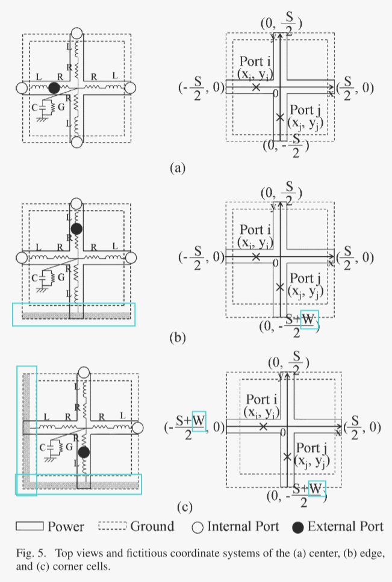

    The proposed equations are empirically induced from the capacitance and inductance values of the cell **by simulating the cell** using an EM simulator with valid range constraints.

    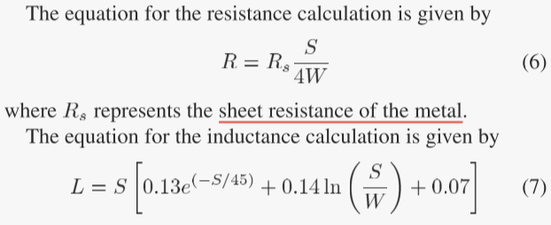

    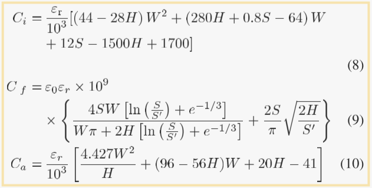

    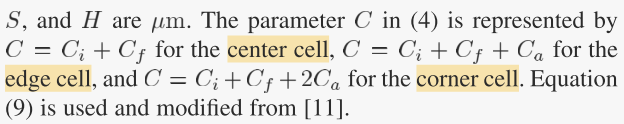

  * **Model of Package Level PDN**

    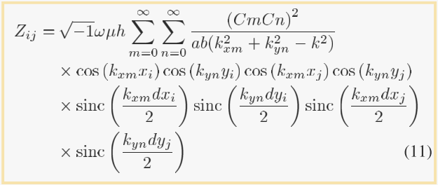

    * **Two issues arise when applying the resonant cavity model to the package level PDN:** 

      * First, the resonant cavity model requires the summation of the mode number from zero to infinity $ \Rightarrow $ **determine the truncated number of the maximum mode**

      * Second, the resonant cavity model cannot cover the **fringing field effect** at the edges of the structure because this model **involves only fields inside the structure**. $ \Rightarrow $ **AWFF (added width by fringing field) parameter**: make an extra PDN

        * For the calculation of the extra PDN using the resonant cavity model, two dimensions of the extra PDN are required. 

          * One dimension is same as the metal plane width in the x- or y- direction of the package level PDN [notated as or in (11)] 

          * and the other is decided by the AWFF parameter, which is given by

            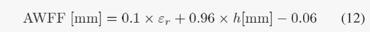

### 反馈

* 一些情况：
  * 集群账号归网管和严老师管，缺啥可以找他们要
  * 国自然
  * 找严老师聊一下
  * 有什么需求可以提

### TODO List

* 整理一下，准备Presentation
* 找严老师聊一下
* 软件安装的事情

## ★ 2024.xx.xx汇报

### 2024.09.20

- 跑通李昀徽学长的`chiplet`布局布线工具
  - 存在多个`c++`版本，可能造成某些未知混乱，并且无法运行debug模式。
  - 通过`devtoolset-11`进行统一，并注释掉会影响环境的部分，跑通。
- 不过这个工具没有考虑`via`，而是会先做一个层分配，然后每条线单层布线，布通率没那么高，需要在这个基础上补充上带有`via`的布线和`icap`的位置
- 后面一段时间需要读懂代码，在这个基础上进行修改。

