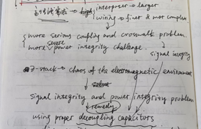

# ★ 2024.08.07汇报
### 一、重分布层（Redistribution Layer，RDL）相关论文
* 思路基本是global+detail，global做的是assignment（分为free assignment，pre-assignment，unified-assignment）和路由指导（MCMF, ILP, A*搜索等）；detail做的就是具体布线，约束，目标等
* 创新点早期有单层到多层，固定角度（45，135）到任意角度，不同array下的布线（square grid array，staggered array，A hexagonal array）


### 二、Deep Trench Capacitor（DTC，Integrated Capacitor，iCap）相关论文
* iCap大概是做什么的：解决signal and power integrity problem



* DTC-first和TSV-first相关论文：Integrated Deep Trench Capacitor in Si Interposer for CoWoS Heterogeneous Integration
  * 老师回复：我简单读了下，核心我理解下来对我们来说有意义的两部。 Sec. II 里两个first的核心其实TSV和DTC生产互相冲突，从PD的角度来看它们之间有spacing的要求，我们就假设我们一起决定TSV和DTC的位置，要保证它们有个最小spacing。另外Sec. III B里有提DTC要连VDD，这在routing里面会和TSV互相占用资源。有就是我们还需要一个constraint，给DTC的数量/位置弄个下界lower bound。这些有了以后应该就是个蛮完整的problem formulation了。这些具体怎么设我们还是原计划，先去问华大。如果他们不知道，我们就去问国重那边


### 三、接下来要做的

* chiplet供电问题
* iCap与TSV之间的关联
* 优化算法的论文


---

# ★ 2024.08.14汇报

### 一、学习PRML

* 第一章
  * 1.5 决策论

  

  * 1.6 信息论

  

  

  

  * 

* 第二章

  * 2.1 Beta分布

  

  * 高斯分布，Gamma分布，学生t分布等
  * 周期变量
  * 混合高斯模型

### 二、讲座：2.5D/3D集成芯片的工艺原理与架构分解

Macro Bump, C4 Bump, hybrid bounding, active interposer, I/O die


### 三、论文

* **Multiobjective Optimization for PSIJ Mitigation and Impedance Improvement Based on PCPS/DR-NSDE in Chiplet-Based 2.5-D Systems**

  

  * **Abstract**
    * chiplet also introduces significant noise challenges
    * This article present an algorithm, incorporating <font color='orange'>power supply induced jitter (PSIJ), system impedance, target impedance, anddecoupling capacitors</font>
      * collaborative optimization and analysis of jitter, noise, and impedance in 2.5-D systems
    * An automatic channel model algorithm and a uniform  <font color='orange'>decoupling capacitor placement strategy </font> are proposed
    * others
      * Pareto front, some strategy is proposed to improve algorithm performance, 
  * **INTRODUCTION**
    * device density and the shared power systems in 2.5-D IC $\Rightarrow$ considerable <font color='orange'>power integrity problems</font> ( particularly the jitter issue )
      * imperfect parasitic impedance of the <u>power delivery network (PDN)</u> and the fluctuating current within the circuitry
      * $\Rightarrow$ voltage fluctuations
      * $\Rightarrow$ <font color='orange'>power supply induced jitter (PSIJ) issue </font>
    * <u>simultaneous switch noise (SSN)</u> is a significant contributor to jitter
      * The employment of <u>decoupling capacitors</u> can lower-system impedance and mitigate the issues arising from the noise.
    * existing research is currently focused on strategies for the placement of decoupling capacitors
      * predominantly focus on PSIJ modeling or decoupling methods, with a noticeable absence of comprehensive analysis of other associated components in chiplet-based systems.
    * present a multiobjective optimization encompassing PSIJ, impedance, target impedance, and decoupling capacitor in 2.5-D IC
  
* **(2017-TCAD) Decoupling Capacitors Placement for a Multichip PDN by a Nature-Inspired Algorithm**

  * PDN及unit cell（UC）模型：参考

    * [9] (LMWC-2017)Analytical Unit Cell Assembly for Efficient Chip Package Power Distribution Network Modeling
    * [9] [12] (2012-TPMT)Modeling and Analysis of a Power Distribution Network in TSV-Based 3-D Memory IC Including P/G TSVs, On-Chip Decoupling Capacitors, and Silicon Substrate Effects

    

  * An automatic assembly process of the equivalent circuits of PDNs, decaps, bump and TSVs is developed based on the S-parameter data concatenation technique introduced in [13].

  * The validated PDN automatic assembly tool [19] will be used in the following for the optimization of the value and locations of the decaps on the PDN.

  * **Nature-Inspired Algorithm**

    * the “fixed” strategy：the position of the decaps are fixed by the designer but their values are to be foundby the GA

    

    * the “moving”strategy：both the positions and the values of the decaps are variables to be found by the GA

    

  * 

### 四、问题

#### 1. 封装基板

* build-up layer什么结构，什么功能，和RDL在功能上的区别是什么


* 有芯基板和无芯基板（参考资料：[先进封装基板](file:///C:/Users/HJH/Desktop/研究方向/物理设计优化/record/link/先进封装基板.mhtml)）
* 有芯基板的刚性芯板层相比于其他层更厚，其通孔直径与其他层之间的差别，导致高频信号在传输过程中存在反射和延迟问题。无芯封装基板厚度仅为传统基板厚度的1/3，厚度降低，不仅使无芯基板更能适应消费类电子产品轻、薄、短、小的趋势，还使它具有更高的信号传输速度、更好的信号完整性、更低的阻抗、更自由的布线设计、以及能够实现更精细的图形和间距等特点。
* 与此同时，缺乏钢性芯板的机械支撑，使得无芯封装基板强度不足，易于翘曲。如何减少制造和装配过程中的翘曲，成为无芯封装基板研究和生产领域的重要课题。三星电子的Kim[8]、矽品的David等通过仿真和实际试验等方式分析无芯封装基板翘曲的热、机械等因素，指导无芯封装基板的设计和生产。常见的降低无芯封装基板翘曲的方法有：在半固化片中添加玻璃纤维以增加刚度，将基板表层电介质材料更换为刚度更强的半固化片，使用低热膨胀系数电介质材料以降低Cu线路-电介质材料之间热膨胀系数失配导致的翘曲，针对制程开发能够减少翘曲的合适夹具，平衡基板各层覆铜率以减少上下层热膨胀系数失配等。
* 埋入式封装基板（参考资料：[先进封装基板](file:///C:/Users/HJH/Desktop/研究方向/物理设计优化/record/link/先进封装基板.mhtml)）
* 参考：
  * [一文看懂封装基板-电子工程专辑](file:///C:/Users/HJH/Desktop/研究方向/物理设计优化/record/link/一文看懂封装基板-电子工程专辑.mhtml)
  * [先进封装，越来越模糊](file:///C:/Users/HJH/Desktop/研究方向/物理设计优化/record/link/先进封装，越来越模糊.mhtml)
    * [异构集成封装类型：2D、2.1D、2.3D、2.5D和3D封装详解](file:///C:/Users/HJH/Desktop/研究方向/物理设计优化/record/link/异构集成封装类型：2D、2.1D、2.3D、2.5D和3D封装详解.mhtml)
    * [先进封装基板](file:///C:/Users/HJH/Desktop/研究方向/物理设计优化/record/link/先进封装基板.mhtml)
    * [半导体封装的载体-封装基板](file:///C:/Users/HJH/Desktop/研究方向/物理设计优化/record/link/半导体封装的载体-封装基板.mhtml)
    * [倒装芯片基板技术介绍](file:///C:/Users/HJH/Desktop/研究方向/物理设计优化/record/link/倒装芯片基板技术介绍.mhtml)

#### 2. 电源分配网络（PDN）

`电源完整性（Power Integrity, PI），去耦电容，目标阻抗`


* [深刻理解电源完整性PI，图文并茂，浅显易懂-CSDN博客](file:///C:/Users/HJH/Desktop/研究方向/物理设计优化/record/link/深刻理解电源完整性PI，图文并茂，浅显易懂.mhtml)


* [信号完整性专题【1】——电源完整性（PI）_pdn目标阻抗计算-CSDN博客](file:///C:/Users/HJH/Desktop/研究方向/物理设计优化/record/link/电源完整性（PI）.mhtml)


### 下周

* 继续看下PDN，然后把上周没看完的论文看完
* 软件安装，研究下软件使用
* 有空继续看PRML

* 接下来几个问题：
  * Benchmark circuits: Source 1 Chuyu Wang, Source Empyrean
  * Optimization objective
    * Impact on PD: routability+ WL (from router)
    * PND cost: refer to two TCAD formulations. Try to find a simulator. Otherwise write a simple toy one. (the worst case) construct a simple formular using density and distance distance <- directly calculated from our results
    * TSV cost: (in theory) s-parameter (Fan Yang's group had experience), (in pratical), maybe just wirelength

* 询问孙经理：
  * 孙经理您好，之后我们组应该主要是我在做这个项目，之后关于软件的一些问题可否向您请教
  * 是这样，我这边整理了以下几个问题
    1. 有没有一些简单的电路例子
    2. Storm中是否有关于TSV的S参数可供读取
    3. Storm中decoupling capacitor位置和大小是否可调
    4. 是否有关于Power Delivery Network相关的参数，cap和PDN改变以后，对芯片的影响（比如IR drop和噪音），是否能有个反馈


---

# ★ 2024.08.21汇报

### 论文

* **PEEC-Based On-chip PDN Impedance Modeling Using Layered Green’s Function**<u>（问严老师）</u>余文剑-》徐宁，严老师
  * Introduction
    * The necessity of the calculation of PDN impedance（high impedance level across a high bandwidth might generate a large
      amount of SSNs）
    * $\Rightarrow$ it is really useful to accurately model the impedance of on-chip PDN for estimation of SSNs
    * **But**: Because **the dimension range of on-chip PDN is wide** and the **geometry and material are complex**, it is **difficult** to obtain <u>the impedance of on-chip PDN with separated power and ground current paths</u> by full-wave simulation as mentioned in [6].
    * Methodology
      * **Firstly** the unit cell of PDN is extracted based on a segmentation method. 
      * **Then** the equivalent circuit of unit cell is modeled by PEEC method. The equivalent circuit of whole PDN is presented by connecting the equivalents circuits of all unit cells. 
      * **Because** the **lossy silicon substrate** right below on-chip PDN could affect the capacitive couplings between metal lines of on-chip PDN, the LGF was introduced to achieve the right capacitance between metal lines.


* **Chip-Package Hierarchical Power Distribution Network Modeling and Analysis Based on a Segmentation Method**<u>（用这个technique需要什么）</u>

  * **“divide and conquer” strategy**: The key ideas of the proposed modeling method are to **decompose** the chip-package hierarchical PDN into several structures, **independently calculate** the decomposed structures, and extract the whole structure’s impedance by using a **segmentation method**.

    * A new modeling method is proposed for a **chip level PDN**
    * resonant cavity model and parameter of AWFF (added width for fringing field) are used for a **package level PDN**
    * and equivalent circuit models are used for **interconnections**.

  * **Segmentation Method**

    

    

    Consequently, the impedance matrix of the total structure can be derived by using the impedance matrices of the independent structures and the segmentation method.

  * **Model ofChip Level PDN**

    

    The proposed equations are empirically induced from the capacitance and inductance values of the cell **by simulating the cell** using an EM simulator with valid range constraints.

    

    

    

  * **Model ofPackage Level PDN**

    

    * **Two issues arise when applying the resonant cavity model to the package level PDN:** 

      * First, the resonant cavity model requires the summation of the mode number from zero to infinity $ \Rightarrow $ **determine the truncated number of the maximum mode**

      * Second, the resonant cavity model cannot cover the **fringing field effect** at the edges of the structure because this model **involves only fields inside the structure**. $ \Rightarrow $ **AWFF (added width by fringing field) parameter**: make an extra PDN

        * For the calculation of the extra PDN using the resonant cavity model, two dimensions of the extra PDN are required. 

          * One dimension is same as the metal plane width in the x- or y- direction of the package level PDN [notated as or in (11)] 

          * and the other is decided by the AWFF parameter, which is given by

            


### 反馈

* 一些情况：
  * 集群账号归网管和严老师管，缺啥可以找他们要
  * 国自然
  * 找严老师聊一下
  * 有什么需求可以提


### TODO List

* 整理一下，准备Presentation
* 找严老师聊一下
  * 软件安装：未问 -> 已问，等回复
  * Our Work：未汇报


# ★ 2024.08.xx汇报

* **kjw项目：TSV布局优化**
  * 初始布局 --> |storm| <--> 优化 --(满足退出条件)--> 得到优化结果
* **国自然：多光罩**
  * **基于参数优化的 DTCO 方法**
    * TSV、深槽电容密度、位置和互连线层数，对物理设计与芯片系统总体PPA的影响
    * 工艺参数本身还决定了生产成本和良率，是芯片产业的核心经济指标
    * 无导数非凸问题的优化方法
  * **基于芯粒划分与解析式优化的布局方法**
    * 多光罩集成芯片相比较单光罩，需要考虑光罩拼接区域的信号完整性损失。在布局中，如果相连接的芯片被放于不同光罩区域，互连线不可避免会跨越光罩拼接区域，造成此信号有较大损失，影响芯片总体性能。
    * 尽可能减少互连线跨越多光罩区域，这可以转化为一个布局前的芯粒划分问题
    * 拟通过高效的解析式（analytical）布局方法，考虑芯粒与键合位的连接关系，构
      造快速的布局方法。
  * **针对延迟匹配和时序优化的布线方法**
    * 通过将芯片网表的时序信息提取成网络流，然后用网络流算法进行焊点分配，从而提升集成芯片时序性能。
  * **多光罩集成芯片的布局布线工具原型开发**
    * 构建 DTCO、布局、布线的数据底座，开发算法模块与图形显示界面，突破多光罩集成芯片敏捷协同优化与布局布线的难题，开发面向多光罩集成芯片的布局布线 EDA 工具原型并开源，为集成芯片研究打下基础。


# ★ 2024.09.25汇报

### 2024.09.20

* 跑通李昀徽学长的`chiplet`布局布线工具
  - 存在多个`c++`版本，可能造成某些未知混乱，并且无法运行debug模式。
  - 通过`devtoolset-11`进行统一，并注释掉会影响环境的部分，跑通。
* 不过这个工具没有考虑`via`，而是会先做一个层分配，然后每条线单层布线，布通率没那么高，需要在这个基础上补充上带有`via`的布线和`icap`的位置
* 后面一段时间需要读懂代码，在这个基础上进行修改。


# ★ 2024.10.02汇报

## 总结

周四周五跟毕老师那边跑材料，周六在路上简单看了两篇论文（按毕老师建议重新看之前看过的的论文），周末周一给曾老师抓着上线写材料，顺便把placement工具编译了一下

# ★ 2024.10.09汇报

## 总结

2号到5号，大概把朱老师的placement跑通了一下，然后6号7号集群跳板机用不了就去看了下placement的一些论文，感觉placement没什么可以做的，看论文都在往GPU加速上卷。8号集群可以正常用了就研究一下storm的router。

8号去邯郸校区帮毕老师跑材料，毕老师找着聊了一下，建议可以在TSV产生的一些影响这方面再调研一下。

# ★ 2024.10.16汇报

## 2024.10.09

### 研究storm

* 问题
  * C4 pad，ASIC Pad为什么这么画，各层表示什么

    

    

  * 这些框只表示boundary，不表示实际层吗，这些文字是否也是这个意思

    

    

  * layer.map中这几个变量是什么
  
    
  
  * 

查找C4 bump的结构

* 论文：

  ```
  ·Walking pads: Managing C4 placement for transient voltage noise minimization（2014-DAC）
  ·Architecture implications of pads as a scarce resource（2014-ISCA）
  ·Tolerating the Consequences of Multiple EM-Induced C4 Bump Failures（2015-TVLSI）
  ·MTTF Enhancement Power-C4 Bump Placement Optimization（2019-VLSI）
  # ------------------------------------------------------ #
  ·Comparison of the electromigration behaviors between micro-bumps and C4 solder bumps（2011-ECTC）
  ```

* 看一下test cases中的这些文件

  

### PDN

意外发现一篇论文（[Architecture implications of pads as a scarce resource | ACM SIGARCH Computer Architecture News](https://dl.acm.org/doi/10.1145/2678373.2665728)），引用了一个工具，似乎可以解PDN，可以找个机会看一下

* 工具：[VoltSpot: a pre-RTL power delivery network (PDN) model for architecture-level PDN noise and reliability evaluation](https://github.com/uvahotspot/VoltSpot)

  ```
  If you use this software or a modified version of it, we would appreciate it if
  you would cite one of the following papers:
  
  1) R. Zhang, K. Wang, B. H. Meyer, M. R. Stan and K. Skadron 
     "Architecture Implications of Pads as a Scarce Resource" In Proceedings of
     the 41th International Symposium on Computer Architecture (ISCA), June 2014
  
  2) R. Zhang, K. Mazumdar, B. Meyer, K. Wang, K. Skadron, and M. R. Stan, 
     "A Cross-Layer Design Exploration of Charge-Recycled Power-Delivery in Many-Layer 3D-IC",
     In Proceedings of the Design Automation Conference (DAC), June, 2015
  
  3) R. Zhang, K. Mazumdar, B. Meyer, K. Wang, K. Skadron, and M. R. Stan, 
     "Transient Voltage Noise in Charge-Recycled Power Delivery Networks for Many-Layer 3D-IC",
     In Proceedings of the International Symposium on Low Power Electronics and Design (ISLPED),
     July, 2015
  ```

  

## 2024.10.10

* 上午在张江校区上课，课上研究了下storm placer的使用，了解了所需文件构成
* 下午去邯郸校区上课
* 晚上开始将placer配置在集群上 

## 2024.10.11

* 完成了placer在集群上的配置


* 计划明天仿照storm placer的输入文件做一个自己的简单case验证一下，然后通过python自动化生成这些文件，再往后看一下要怎么通过python实现自动化文件输入和布线，形成一个简单的流程


## 2024.10.12

* 实现python自动化生成storm所需文件
* 集群的跳板机又用不了了......还没对该简单的case进行验证


